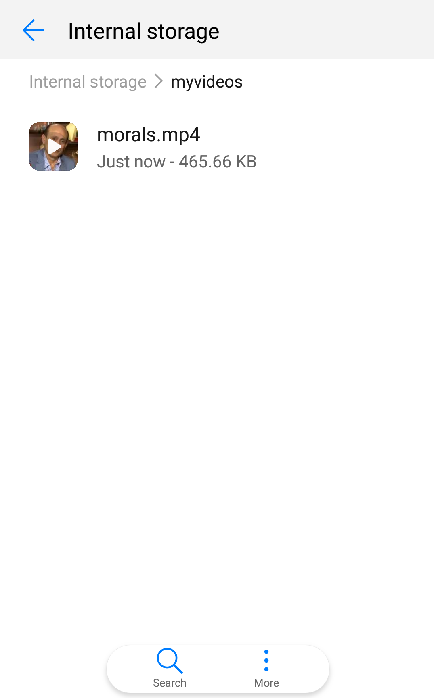
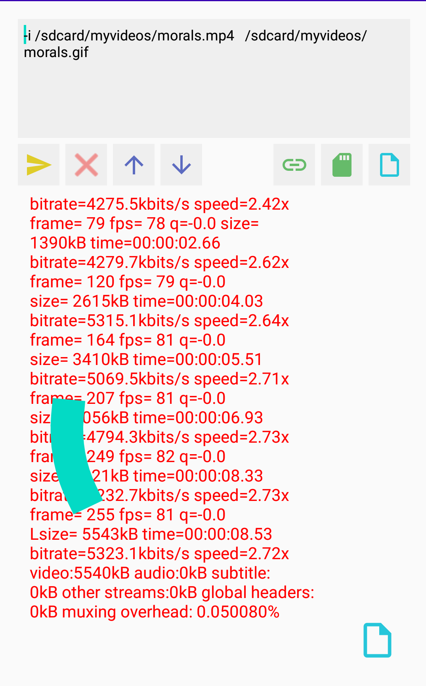

<div align="center">
  <a href="https://play.google.com/store/apps/details?id=com.ma7moud3ly.ffmpegdroid" target="_blank">
    
  </a>

# [FFMPEG DROID](https://play.google.com/store/apps/details?id=com.ma7moud3ly.ffmpegdroid) 
```
FFMPEG multimedia framework now on you smart phone with simple GUI.
```
- [FFMPEG](https://ffmpeg.org/) is a command line tool used to record,convert,edit and stream audio and video.
- [FFMPEG DROID](https://play.google.com/store/apps/details?id=com.ma7moud3ly.ffmpegdroid) brings the famous great multimedia tool in your hands.. 

<br>
<div>
  
  
  

</div>
<br>
<div>
  
  
</div>
<br>
[Download From Google Play](https://play.google.com/store/apps/details?id=com.ma7moud3ly.ffmpegdroid) 
</div>
